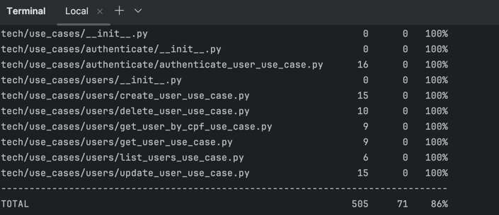
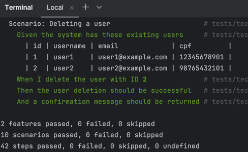
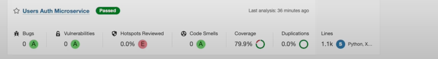

# Microsserviço de Usuários e Autenticação

Este repositório contém o microsserviço responsável pelo gerenciamento de usuários e autenticação da plataforma, utilizando Amazon Cognito para segurança.

## Tecnologias

- **Framework**: FastAPI
- **Linguagem**: Python 3.10+
- **Banco de Dados**: PostgreSQL
- **Autenticação**: Amazon Cognito
- **Documentação API**: Swagger/OpenAPI
- **Testes**: Pytest + Behave
- **Cobertura de Testes**: Coverage.py
- **CI/CD**: GitHub Actions

## Estrutura do Projeto

```
tech/
├── api/
│   ├── auth_router.py
│   └── users_router.py
├── domain/
│   └── entities/
│       └── user.py
├── infra/
│   ├── databases/
│   │   └── database.py
│   └── gateways/
│       └── cognito_gateway.py
├── interfaces/
│   ├── controllers/
│   │   ├── auth_controller.py
│   │   └── user_controller.py
│   ├── gateways/
│   │   ├── user_gateway.py
│   │   └── cognito_gateway.py
│   └── schemas/
│       ├── auth_schema.py
│       └── user_schema.py
└── use_cases/
    ├── authenticate/
    │   └── authenticate_user_use_case.py
    └── users/
        ├── create_user_use_case.py
        ├── delete_user_use_case.py
        ├── get_user_by_cpf_use_case.py
        ├── get_user_use_case.py
        ├── list_users_use_case.py
        └── update_user_use_case.py
```

## Configuração do Ambiente

### Requisitos

- Python 3.10+
- PostgreSQL 13+
- Conta na AWS para Amazon Cognito


## Banco de Dados

### Modelo de Dados

```sql
CREATE TABLE users (
    id SERIAL PRIMARY KEY,
    username VARCHAR(100) NOT NULL,
    email VARCHAR(255) UNIQUE NOT NULL,
    cpf VARCHAR(11) UNIQUE NOT NULL,
    full_name VARCHAR(255) NOT NULL,
    phone VARCHAR(20),
    created_at TIMESTAMP NOT NULL DEFAULT NOW(),
    updated_at TIMESTAMP NOT NULL DEFAULT NOW()
);
```

## Endpoints da API

### Endpoints de Autenticação

- `POST /api/auth/login` - Autentica um usuário e retorna um token

### Endpoints de Usuários

- `GET /api/users/` - Lista todos os usuários
- `GET /api/users/{user_id}` - Obtém um usuário pelo ID
- `GET /api/users/cpf/{cpf}` - Obtém um usuário pelo CPF
- `POST /api/users/` - Cria um novo usuário
- `PUT /api/users/{user_id}` - Atualiza um usuário existente
- `DELETE /api/users/{user_id}` - Remove um usuário

## Fluxo de Autenticação

1. O cliente envia as credenciais (CPF e senha) para o endpoint `/api/auth/login`
2. O microsserviço valida as credenciais com o Amazon Cognito
3. Se as credenciais forem válidas, um token JWT é retornado
4. O cliente utiliza este token para acessar endpoints protegidos de outros microsserviços

## Integração com Outros Serviços

- **Microsserviço de Pedidos**: Fornece informações do usuário para a criação de pedidos
- **Microsserviço de Pagamentos**: Verifica a identidade do usuário para processar pagamentos
- **API Gateway**: Para controle de acesso centralizado

## Testes

### Executando Testes Unitários

```bash
# Execute todos os testes
cd tech

pytest

# Execute testes com cobertura
pytest --cov=tech tests/

# Gere relatório HTML de cobertura
pytest --cov=tech --cov-report=html tests/
```

### Executando Testes BDD

```bash

cd tech


# Execute todos os testes BDD
behave tests/tech/bdd/features/

# Execute um cenário específico
behave tests/tech/bdd/features/users.feature

# Execute testes com tags específicas
behave tests/tech/bdd/features/ --tags=authentication
```

#### Exemplo de Cenário BDD

```gherkin
Feature: Autenticação de usuários
  Como um usuário
  Eu quero me autenticar na plataforma
  Para acessar funcionalidades protegidas

  Scenario: Login com credenciais válidas
    Given que existe um usuário com CPF "12345678901" e senha "Senha@123"
    When eu tento fazer login com CPF "12345678901" e senha "Senha@123"
    Then o login deve ser bem-sucedido
    And um token JWT válido deve ser retornado
```

### Cobertura de Testes









> **Nota**: A imagem acima mostra a estrutura de diretórios dos testes, incluindo a organização dos testes BDD.
